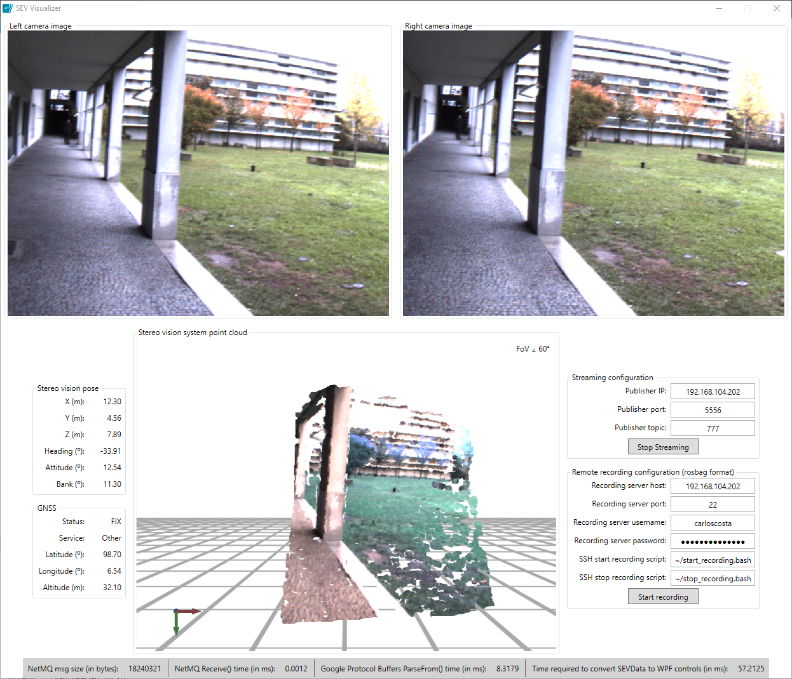

# RustBotCSharp
C# libraries and GUI application for the [RustBot](https://github.com/miguelriemoliveira/RustBot) project.

[](http://www.youtube.com/watch?v=jA0ByGyGTN0)

Video 1: RustBot C# GUI


# RustBotCSharp.GUI application

To install the application simply download the SEV-Visualizer.exe executable associated with the [latest release](Https://github.com/carlosmccosta/RustBotCSharp/releases), extract the files to a folder and run setup.exe (if the application is already installed you must uninstall the previous version first).

Once installed, the application can be started using the shortcut on the desktop or using the start menu (the application name is "SEV Visualizer").

On the first run of the application you should configure:

- For streaming:
  - The IP associated with the [ZeroMQ](http://zeromq.org/) publisher (running inside the NUC)

- For recording:
  - The recording server IP (running inside the NUC)
  - The NUC account username
  - The NUC account password

When you close the application the settings are stored in the CommunicationsModel.xml file, and the password is stored in encrypted format.

The application shows the streaming of the left and right camera images with the respective generated cloud point, as well as the estimated pose of the stereo vision system and the GNSS (GPS) position.

Data streaming can be started / stopped with the "Start / Stop streaming" button.

The recording of [rosbags](http://wiki.ros.org/Bags) in the NUC can be started / stopped with the "Start / Stop recording" button (the rosbags are stored on the NUC desktop folder).


### Shortcuts for the cameras image windows:

- Zoom -> Shift + ScrollWheel
- Zoom with ROI selection -> Alt + LeftClickHold + Drag + LeftClickRelease
- Restore zoom -> Alt + LeftClick
- Pan -> Ctrl + LeftClick


### Shortcuts for the 3D point cloud window:

- Zoom -> ScrollWheel
- Pan -> LeftClick
- Rotate -> RightClick | Arrow keys


To move within the 3d scene (activated by clicking in the 3d viewport and pressing arrow up key)
   
- W -> Move front
- A -> Move left
- S -> Move back
- D -> Move right
- Q -> Move up
- Z -> Move down


# RustBotCSharp.Communication library

For integrating the [RustBotCSharp.Communication](RustBotCSharp.Communication) C# library within your application you need to:

1. Add the [RustBotCSharp.Communication Nuget package](https://www.nuget.org/packages/RustBotCSharp.Communication) to your project or extract the dlls from the RustBotCSharp.Communication.Dlls.zip file [from the lastest release](https://github.com/carlosmccosta/RustBotCSharp/releases) and add the references to your project.
   * [Nuget tutorial](http://docs.nuget.org/ndocs/consume-packages/finding-and-choosing-packages)
   * [Nuget symbols tutorial](https://www.symbolsource.org/Public/Wiki/Using)
2. Make a subclass of [SEVDataSubscriber](https://github.com/carlosmccosta/RustBotCSharp/blob/master/RustBotCSharp.Communication/SEVDataSubscriber.cs)
3. Implement the "virtual bool ProcessData (SEVData data)" method
4. Initialize the class using the "public bool InitializeSubscriber(string subscriberUrl = "tcp://localhost:13370", string topic = "")" method
5. Call the "bool StartReceivingDataAsynchronously()" method to start receiving and processing data asynchronously or call the method "virtual CodedInputStream ReceiveData()" followed by the method "virtual SEVData ParseData(CodedInputStream serializedData)" to process data in a blocking synchronous approach.

You can look at the [SEVDataSubscriberWPF class](https://github.com/carlosmccosta/RustBotCSharp/blob/master/RustBotCSharp.GUI/SEVDataSubscriberWPF.cs) for an example of usage of the [SEVDataSubscriber class](https://github.com/carlosmccosta/RustBotCSharp/blob/master/RustBotCSharp.Communication/SEVDataSubscriber.cs).

For better understanding of how the communication protocol works, you should read the [ZeroMQ](http://zeromq.org/intro:read-the-manual), [NetMQ](https://netmq.readthedocs.io/en/latest/) and [Google Protocol Buffers C# tutorial](https://developers.google.com/protocol-buffers/docs/csharptutorial) documentation.


## Building notes

For proper 3D point cloud view in Windows 10 on a multi-GPU system it is necessary to compile the [Helix toolkit](http://www.helix-toolkit.org/) with [this fix](https://github.com/helix-toolkit/helix-toolkit/issues/282).

You can then [generate the nuget packages](https://docs.microsoft.com/en-us/nuget/create-packages/creating-a-package#running-nuget-pack-to-generate-the-nupkg-file) using the after_build scripts in the [appveyor.yml](https://github.com/helix-toolkit/helix-toolkit/blob/develop/appveyor.yml) and compile the [Helix Toolkit solution](https://github.com/helix-toolkit/helix-toolkit/blob/develop/Source/HelixToolkit.Wpf.SharpDX.sln).

```
nuget pack Source\HelixToolkit\HelixToolkit.nuspec -version "1.0.0"
nuget pack Source\HelixToolkit.Wpf\HelixToolkit.Wpf.nuspec -version "1.0.0"
nuget pack Source\HelixToolkit.Wpf.SharpDX\HelixToolkit.Wpf.Sharpdx.nuspec -version "1.0.0"
```

The testing and compilation of this repository used the helix-toolkit at the commit with hash [02dcd5b596bcfdabf63418f3b45bd763ca271109](https://github.com/helix-toolkit/helix-toolkit/commit/02dcd5b596bcfdabf63418f3b45bd763ca271109)

You should clone the helix-toolkit and then checkout to this version (otherwise you may need to check if the helix-toolkit changed and make upgrade modifications to the source code accordingly).

```
git clone https://github.com/helix-toolkit/helix-toolkit.git
git checkout 02dcd5b596bcfdabf63418f3b45bd763ca271109
```
