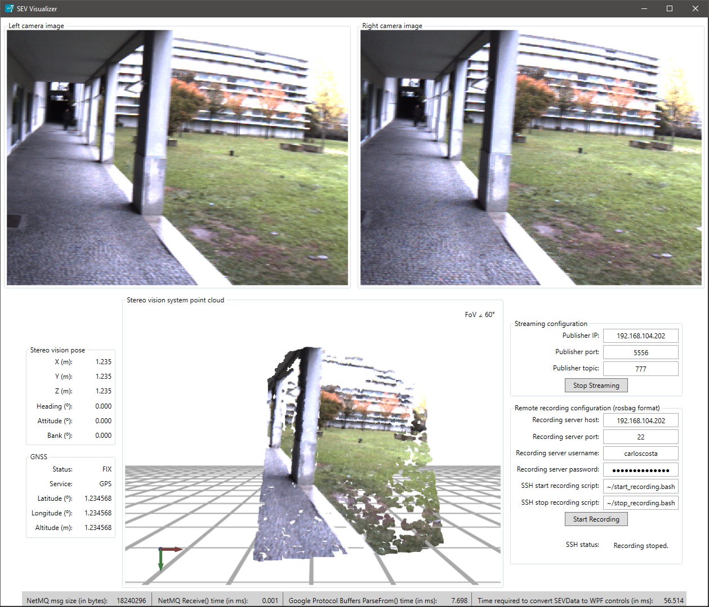

# RustBotCSharp
C# libraries and applications for the [RustBot](https://github.com/miguelriemoliveira/RustBot) project.

Figure 1: RustBot C# GUI

## Notes

For proper 3D point cloud view in Windows 10 it is necessary to compile the Helix library with [this fix](https://github.com/helix-toolkit/helix-toolkit/issues/282).

You can then generate the nuget packages using the after_build scripts in the appveyor.yml
